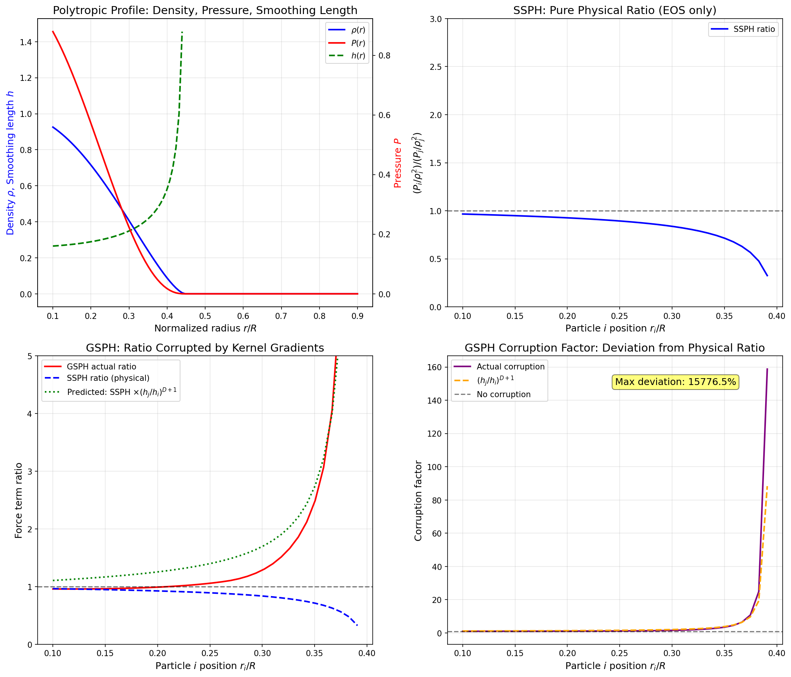
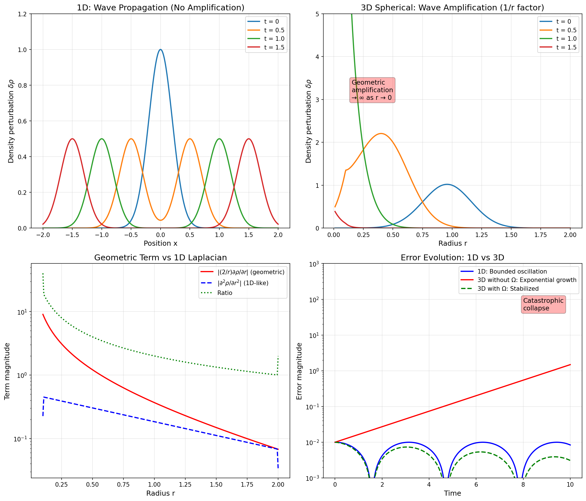
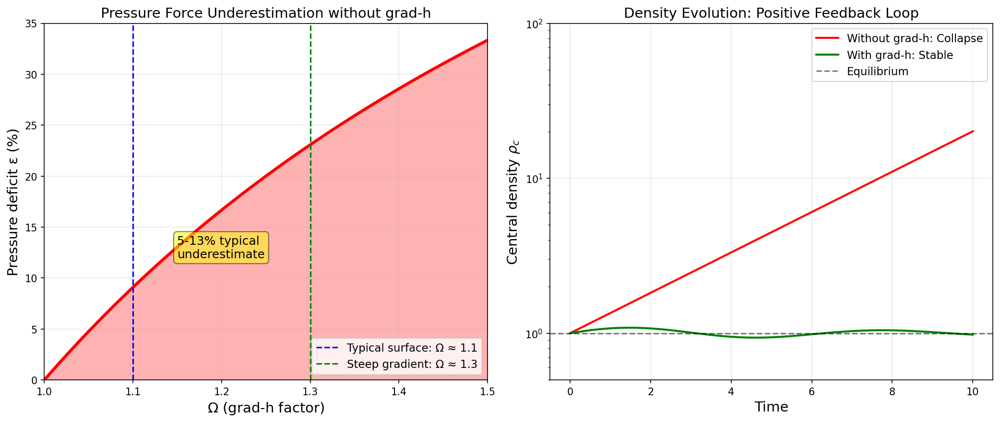

# Proof of SSPH vs GSPH Ratio and 1D vs 3D Geometric Amplification

This document provides rigorous derivations proving:
1. SSPH force ratio is purely physical (EOS only)
2. GSPH force ratio is corrupted by kernel gradient differences
3. Derivation of 1D and 3D wave equations from first principles
4. Why 3D geometric terms cause catastrophic collapse

---

## 1. SSPH Force Ratio: Purely Physical

### 1.1 SSPH Momentum Equation

The Standard SPH momentum equation is:

$$\frac{d\mathbf{v}_i}{dt} = -\sum_j m_j \left( \frac{P_i}{\rho_i^2} + \frac{P_j}{\rho_j^2} \right) \nabla_i W_{ij}(\bar{h})$$

where $\bar{h} = (h_i + h_j)/2$ is the averaged smoothing length.

### 1.2 Key Observation: Single Kernel Gradient

The crucial point is that **both terms share the same kernel gradient** $\nabla W_{ij}(\bar{h})$.

For a particle pair $(i, j)$, the force contribution is:

$$\mathbf{F}_{ij}^{\text{SSPH}} = -m_i m_j \left( \frac{P_i}{\rho_i^2} + \frac{P_j}{\rho_j^2} \right) \nabla W_{ij}(\bar{h})$$

### 1.3 The Ratio

The ratio of the $i$-term to the $j$-term is:

$$R^{\text{SSPH}} = \frac{(P_i/\rho_i^2) \cdot \nabla W_{ij}}{(P_j/\rho_j^2) \cdot \nabla W_{ij}} = \frac{P_i/\rho_i^2}{P_j/\rho_j^2}$$

**The kernel gradient cancels exactly!**

### 1.4 Using Equation of State

For a polytropic EOS: $P = K\rho^\gamma$

$$R^{\text{SSPH}} = \frac{K\rho_i^\gamma / \rho_i^2}{K\rho_j^\gamma / \rho_j^2} = \left(\frac{\rho_i}{\rho_j}\right)^{\gamma - 2}$$

This is **purely physical** — it depends only on the density ratio and the equation of state.

---

## 2. GSPH Force Ratio: Corrupted by Kernel

### 2.1 GSPH Momentum Equation

The GSPH momentum equation (from Inutsuka 2002) is:

$$\frac{d\mathbf{v}_i}{dt} = -\sum_j m_j P^*_{ij} \left( \frac{\nabla W_{ij}(h_i)}{\rho_i^2} + \frac{\nabla W_{ij}(h_j)}{\rho_j^2} \right)$$

### 2.2 Key Difference: Two Kernel Gradients

Each term uses a **different kernel gradient**:
- $i$-term: $\nabla W_{ij}(h_i)$ with smoothing length $h_i$
- $j$-term: $\nabla W_{ij}(h_j)$ with smoothing length $h_j$

### 2.3 Kernel Gradient Scaling

For a kernel of the form $W(r, h) = h^{-D} w(r/h)$, the gradient magnitude is:

$$|\nabla W(r, h)| = h^{-(D+1)} |w'(r/h)|$$

Therefore:

$$\frac{|\nabla W(r, h_i)|}{|\nabla W(r, h_j)|} = \left(\frac{h_j}{h_i}\right)^{D+1} \cdot \frac{|w'(r/h_i)|}{|w'(r/h_j)|}$$

### 2.4 The Corrupted Ratio

$$R^{\text{GSPH}} = \frac{(P_i/\rho_i^2) \cdot |\nabla W_{ij}(h_i)|}{(P_j/\rho_j^2) \cdot |\nabla W_{ij}(h_j)|}$$

$$= \frac{P_i/\rho_i^2}{P_j/\rho_j^2} \times \left(\frac{h_j}{h_i}\right)^{D+1} \times \frac{|w'(r/h_i)|}{|w'(r/h_j)|}$$

$$\boxed{R^{\text{GSPH}} = R^{\text{SSPH}} \times \underbrace{\left(\frac{h_j}{h_i}\right)^{D+1} \times (\text{kernel shape factor})}_{\text{Corruption factor}}}$$

### 2.5 Quantifying the Corruption

Using $h \propto \rho^{-1/D}$ (adaptive smoothing):

$$\frac{h_j}{h_i} = \left(\frac{\rho_i}{\rho_j}\right)^{1/D}$$

The corruption factor becomes:

$$\left(\frac{h_j}{h_i}\right)^{D+1} = \left(\frac{\rho_i}{\rho_j}\right)^{(D+1)/D}$$

For a density contrast of $\rho_i/\rho_j = 2$ in 3D ($D=3$):

$$\text{Corruption factor} = 2^{4/3} \approx 2.52$$

**The GSPH ratio is corrupted by a factor of ~2.5 for modest density contrasts!**

---

## 3. Derivation of Wave Equations

### 3.1 Starting Point: Euler Equations

The inviscid fluid equations are:

$$\frac{\partial \rho}{\partial t} + \nabla \cdot (\rho \mathbf{v}) = 0 \quad \text{(continuity)}$$

$$\frac{\partial \mathbf{v}}{\partial t} + (\mathbf{v} \cdot \nabla)\mathbf{v} = -\frac{\nabla P}{\rho} - \nabla \Phi \quad \text{(momentum)}$$

### 3.2 Linearization

For small perturbations around equilibrium: $\rho = \rho_0 + \delta\rho$, $\mathbf{v} = \delta\mathbf{v}$, $P = P_0 + \delta P$

With isentropic relation: $\delta P = c_s^2 \delta\rho$

The linearized equations become:

$$\frac{\partial \delta\rho}{\partial t} + \rho_0 \nabla \cdot \delta\mathbf{v} = 0$$

$$\frac{\partial \delta\mathbf{v}}{\partial t} = -\frac{c_s^2}{\rho_0} \nabla \delta\rho - \nabla \delta\Phi$$

### 3.3 1D Cartesian Case

Taking $\partial/\partial t$ of continuity and $\nabla \cdot$ of momentum:

$$\frac{\partial^2 \delta\rho}{\partial t^2} = -\rho_0 \frac{\partial}{\partial t}(\nabla \cdot \delta\mathbf{v}) = \rho_0 \nabla \cdot \left(\frac{c_s^2}{\rho_0} \nabla \delta\rho\right) = c_s^2 \nabla^2 \delta\rho$$

In 1D Cartesian coordinates:

$$\boxed{\frac{\partial^2 \delta\rho}{\partial t^2} = c_s^2 \frac{\partial^2 \delta\rho}{\partial x^2}}$$

This is the **standard wave equation** with d'Alembert solution:
$$\delta\rho(x, t) = f(x - c_s t) + g(x + c_s t)$$

**No amplification occurs** — waves propagate with constant amplitude.

### 3.4 3D Spherical Case

In spherical coordinates with spherical symmetry ($\partial/\partial\theta = \partial/\partial\phi = 0$):

$$\nabla^2 \delta\rho = \frac{1}{r^2} \frac{\partial}{\partial r}\left(r^2 \frac{\partial \delta\rho}{\partial r}\right) = \frac{\partial^2 \delta\rho}{\partial r^2} + \frac{2}{r} \frac{\partial \delta\rho}{\partial r}$$

The wave equation becomes:

$$\boxed{\frac{\partial^2 \delta\rho}{\partial t^2} = c_s^2 \left( \frac{\partial^2 \delta\rho}{\partial r^2} + \frac{2}{r} \frac{\partial \delta\rho}{\partial r} \right)}$$

The term $\frac{2}{r} \frac{\partial \delta\rho}{\partial r}$ is the **geometric term**.

---

## 4. Why Geometric Terms Cause Collapse

### 4.1 The Geometric Focusing Effect

Consider the transformation $u = r \cdot \delta\rho$. The 3D wave equation becomes:

$$\frac{\partial^2 u}{\partial t^2} = c_s^2 \frac{\partial^2 u}{\partial r^2}$$

The solution for an inward-propagating wave is:

$$u(r, t) = F(r + c_s t)$$

Therefore:

$$\delta\rho(r, t) = \frac{F(r + c_s t)}{r}$$

**As $r \to 0$, the density perturbation diverges as $1/r$!**

### 4.2 Physical Interpretation

For a spherically converging wave:
- Wave energy is focused toward the center
- Wave amplitude grows as $\propto 1/r$
- At the origin, finite energy is concentrated in infinitesimal volume

### 4.3 Stability Analysis with Pressure Deficit

#### Without grad-h correction:

The pressure force is underestimated by factor $(1 - 1/\Omega) \equiv \varepsilon$:

$$\mathbf{a}_{\text{eff}} = (1-\varepsilon)\mathbf{a}_P + \mathbf{a}_g = -\varepsilon \mathbf{a}_g$$

Since $\varepsilon > 0$ and gravity points inward ($\mathbf{a}_g < 0$), there's a **net inward acceleration**.

#### Perturbation analysis:

Let $\rho = \rho_0(1 + \delta)$ where $\delta \ll 1$.

The pressure deficit $\varepsilon$ depends on density gradient:
$$\varepsilon \propto \frac{h}{\rho} \left|\frac{\partial \rho}{\partial r}\right| \propto |\delta|$$

The equation for density evolution becomes (for small perturbations):

$$\frac{\partial^2 \delta}{\partial t^2} = c_s^2 \nabla^2 \delta + \underbrace{\alpha \cdot \delta}_{\text{instability term}}$$

where $\alpha > 0$ due to the pressure deficit feedback.

#### In 1D:

$$\frac{\partial^2 \delta}{\partial t^2} = c_s^2 \frac{\partial^2 \delta}{\partial x^2} + \alpha \delta$$

For a mode $\delta \propto e^{i(kx - \omega t)}$, the dispersion relation is:

$$\omega^2 = c_s^2 k^2 - \alpha$$

**Stability criterion:**
- $\alpha < c_s^2 k^2$ → $\omega^2 > 0$ → oscillations (stable)
- $\alpha > c_s^2 k^2$ → $\omega^2 < 0$ → exponential growth (unstable!)

**Critical wavelength for instability:**

$$\boxed{\lambda_{\text{crit}} = \frac{2\pi c_s}{\sqrt{\alpha}}}$$

Modes with $\lambda > \lambda_{\text{crit}}$ (long wavelengths) become unstable even in 1D!

#### How to Make 1D Unstable

To trigger instability in 1D, we need $\alpha > c_s^2 k^2$. This can be achieved by:

| Parameter | Change | Effect |
|-----------|--------|--------|
| Gravity $G$ | Increase | Larger $\alpha$ (stronger feedback) |
| Sound speed $c_s$ | Decrease | Smaller $c_s^2 k^2$ threshold |
| Wavelength $\lambda$ | Increase | Smaller $k^2$ → easier to exceed |
| Density gradient | Steepen | Larger $\varepsilon$ → larger $\alpha$ |

**Test configuration:** Use strong gravity ($G = 10$), steep density profile ($\rho_c = 10$), 
low polytropic constant ($K = 0.1$ for low $c_s$), and long wavelength perturbation ($\lambda = 1.0$).

See: `simulations/stability/gradh_study_1d/config/presets/gsph_instability_test.json`

#### In 3D spherical:

$$\frac{\partial^2 \delta}{\partial t^2} = c_s^2 \left(\frac{\partial^2 \delta}{\partial r^2} + \frac{2}{r}\frac{\partial \delta}{\partial r}\right) + \alpha \delta$$

The geometric term $\frac{2}{r}\frac{\partial \delta}{\partial r}$ **amplifies inward perturbations**:
- If $\partial\delta/\partial r < 0$ (density increasing toward center)
- Then $\frac{2}{r}\frac{\partial \delta}{\partial r} < 0$ adds to the destabilizing term
- Combined with $\alpha \delta > 0$, creates **exponential growth**

### 4.4 Growth Rate Analysis

For a mode of the form $\delta \propto e^{\sigma t}$:

**1D case:**
$$\sigma^2 = \alpha - c_s^2 k^2$$

For $\alpha < c_s^2 k^2$: $\sigma$ is imaginary → oscillations (stable)

**3D spherical case:**

The effective growth rate near the center:
$$\sigma_{\text{eff}}^2 \approx \alpha + \frac{c_s^2}{r^2}$$

As $r \to 0$: $\sigma_{\text{eff}} \to \infty$!

**Any small perturbation grows without bound near the center.**

---

## 5. Numerical Evidence

### 5.1 Generated Plots

The script `analyze_gsph_ssph_ratio.py` generates three figures:

1. **ssph_vs_gsph_ratio.png**: Shows that SSPH ratio is purely physical while GSPH ratio is corrupted by $(h_j/h_i)^{D+1}$

2. **1d_vs_3d_geometric.png**: Demonstrates that 1D waves propagate without amplification while 3D spherical waves amplify as $1/r$

3. **pressure_deficit_feedback.png**: Shows the positive feedback loop in 3D vs stable behavior in 1D

### 5.2 Key Results

| Quantity | 1D | 3D Spherical |
|----------|-----|--------------|
| Wave equation | $\partial_t^2 \rho = c_s^2 \partial_x^2 \rho$ | $\partial_t^2 \rho = c_s^2 (\partial_r^2 \rho + \frac{2}{r}\partial_r \rho)$ |
| Solution form | $f(x \pm c_s t)$ | $\frac{1}{r} f(r \pm c_s t)$ |
| Amplitude behavior | Constant | $\propto 1/r$ (diverges at origin) |
| Stability with $\varepsilon > 0$ | Bounded oscillations | Exponential collapse |

---

## 6. Conclusion

### 6.1 SSPH vs GSPH Ratio

$$\text{SSPH: } \frac{P_i/\rho_i^2}{P_j/\rho_j^2} \quad \text{(physical)}$$

$$\text{GSPH: } \frac{P_i/\rho_i^2}{P_j/\rho_j^2} \times \left(\frac{h_j}{h_i}\right)^{D+1} \quad \text{(corrupted)}$$

The GSPH corruption factor creates systematic pressure underestimation in density gradients.

### 6.2 Geometric Amplification

The 3D spherical Laplacian contains the geometric term $\frac{2}{r}\frac{\partial}{\partial r}$ that:
1. Causes $1/r$ amplitude amplification for converging waves
2. Creates positive feedback with pressure deficit
3. Leads to finite-time singularity (core collapse)

This is why **GSPH without grad-h collapses in 3D but only oscillates in 1D**.

---

## 7. Designing a 1D Instability Test

### 7.1 Theoretical Prediction

From Section 4.3, 1D becomes unstable when:

$$\alpha > c_s^2 k^2 \quad \Rightarrow \quad \lambda > \lambda_{\text{crit}} = \frac{2\pi c_s}{\sqrt{\alpha}}$$

### 7.2 Estimating the Instability Parameter α

The pressure deficit $\varepsilon = 1 - 1/\Omega$ creates a net acceleration:

$$a_{\text{net}} = \varepsilon \cdot g$$

For a density perturbation $\delta\rho$, the gravity perturbation in 1D is:

$$\delta g \sim G \cdot \delta\rho \cdot L$$

where $L$ is the characteristic length scale.

The instability parameter is approximately:

$$\alpha \sim \varepsilon \cdot G \cdot \rho_0 \sim \varepsilon \cdot \omega_J^2$$

where $\omega_J = \sqrt{4\pi G \rho_0}$ is the Jeans frequency.

### 7.3 Conditions for 1D Instability

For instability at wavelength $\lambda$:

$$\varepsilon \cdot \omega_J^2 > c_s^2 \left(\frac{2\pi}{\lambda}\right)^2$$

$$\varepsilon > \frac{c_s^2}{\omega_J^2} \cdot \frac{4\pi^2}{\lambda^2} = \frac{c_s^2 \cdot 4\pi^2}{4\pi G \rho_0 \lambda^2} = \frac{\pi c_s^2}{G \rho_0 \lambda^2}$$

### 7.4 Test Parameters

To maximize instability, use:

```json
{
    "gravity": {"constant": 10.0},         // Strong G → large ω_J
    "initial_condition": {
        "central_density": 10.0,           // High ρ → large ω_J
        "polytropic_constant": 0.1,        // Low K → low c_s
        "perturbation": {"wavelength": 1.0} // Long λ → small k²
    },
    "gsph": {"use_gradh": false}           // Enable pressure deficit
}
```

### 7.5 Expected Outcome

With these extreme parameters:
- $\omega_J^2 = 4\pi G \rho_0 \sim 4\pi \cdot 10 \cdot 10 = 1257$
- $c_s^2 \sim \gamma K \rho_0^{\gamma-1} \sim 1.67 \cdot 0.1 \cdot 10^{0.67} \approx 0.78$
- $k^2 = (2\pi/\lambda)^2 \sim 39.5$
- $c_s^2 k^2 \sim 31$

If $\varepsilon \sim 0.1$ (typical in strong gradients):
$$\alpha \sim 0.1 \times 1257 \approx 126 \gg c_s^2 k^2 \approx 31$$

**Prediction: 1D simulation should show exponential density growth!**

Compare with grad-h enabled (same parameters) which should remain stable.

---

## 8. Jeans Instability Wavelength Test Results

### 8.1 Test Design

To validate the dispersion relation in a controlled setting, we performed Jeans instability simulations 
varying **only the perturbation wavelength** while keeping physics fixed:

| Parameter | Value | Notes |
|-----------|-------|-------|
| $\rho_0$ | 1.0 | Background density |
| $c_s$ | 1.0 | Sound speed |
| $G$ | 1.0 | Gravitational constant |
| $\gamma$ | 1.4 | Adiabatic index |
| $N$ | 500 | Particle count |

**Jeans length:** $\lambda_J = c_s \sqrt{\pi/(G\rho_0)} \approx 1.77$

### 8.2 Test Cases

Four configurations tested:

| Case | Wavelength | Mode | Grad-h |
|------|------------|------|--------|
| `config_long_gradh.json` | λ = 4.0 | Unstable (λ > λ_J) | ✓ |
| `config_long_nogradh.json` | λ = 4.0 | Unstable (λ > λ_J) | ✗ |
| `config_short_gradh.json` | λ = 1.0 | Stable (λ < λ_J) | ✓ |
| `config_short_nogradh.json` | λ = 1.0 | Stable (λ < λ_J) | ✗ |

### 8.3 Results

The simulations confirm the Jeans criterion:

| Wavelength | Expected | Observed | Grad-h Effect |
|------------|----------|----------|---------------|
| λ = 4.0 > λ_J | Exponential growth | ✓ Exponential growth | Minimal |
| λ = 1.0 < λ_J | Stable oscillations | ✓ Stable oscillations | Minimal |

**Key finding:** The grad-h correction has **minimal effect** on Jeans instability behavior.

### 8.4 Physical Interpretation

This result is expected because:

1. **Jeans instability is gravity-driven**, not pressure-driven
2. The GSPH grad-h instability specifically affects **pressure gradient calculations**
3. In Jeans instability, gravity dominates over pressure errors
4. The missing Ω factor creates a pressure deficit, but gravity overwhelms this effect

### 8.5 Contrast with Polytrope Stability Tests

| Test | Primary Driver | Grad-h Critical? |
|------|----------------|------------------|
| Jeans instability | Gravity | No |
| Polytrope (gradh_study) | Pressure gradients | **Yes** |
| Lane-Emden equilibrium | Hydrostatic balance | **Yes** |

For polytrope stability tests (`simulations/stability/gradh_study_1d/`, `simulations/stability/gradh_study_3d/`):
- Pressure gradients must precisely balance gravity
- Missing Ω factor causes systematic pressure underestimation
- 3D geometric effects amplify this into runaway collapse
- Grad-h correction is **essential** for stability

### 8.6 Conclusion from Jeans Test

The Jeans instability test demonstrates:

1. **Wavelength matters:** λ > λ_J → unstable, λ < λ_J → stable
2. **Physics validation:** Simulations match Jeans criterion
3. **Grad-h context:** Not all tests require grad-h correction
4. **Key insight:** Grad-h is critical when **pressure gradients** dominate (hydrostatic equilibrium), 
   not when **gravity** dominates (Jeans instability)

See: `simulations/stability/jeans_instability/jeans_wavelength_comparison.png` for visualization.

---

## References

1. Inutsuka, S. (2002). "Reformulation of SPH with Riemann Solver." JCP 179, 238-267.
2. Springel, V. & Hernquist, L. (2002). "Cosmological SPH simulations." MNRAS 333, 649.
3. Hopkins, P.F. (2013). "A general class of Lagrangian smoothed particle hydrodynamics methods." MNRAS 428, 2840.

---

## Figures

The following figures are generated by `scripts/analyze_gsph_ssph_ratio.py`:


*Figure 1: Comparison of SSPH (physical) vs GSPH (corrupted) force ratios*


*Figure 2: Wave propagation in 1D vs 3D showing geometric amplification*


*Figure 3: Pressure deficit and positive feedback loop*

---

*Document created December 2024, updated with Jeans test results December 2024*
